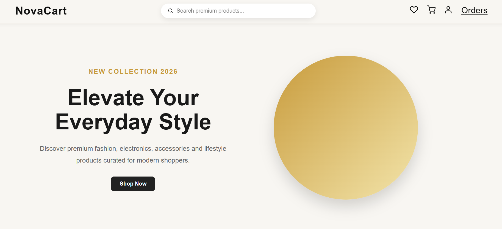
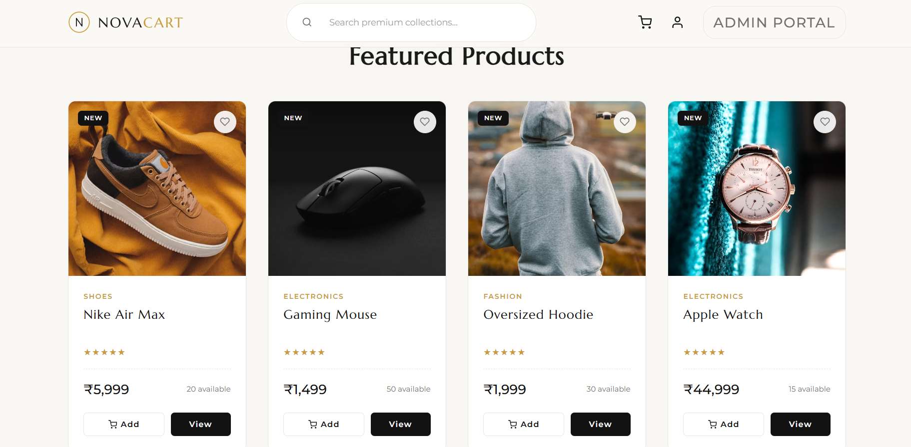
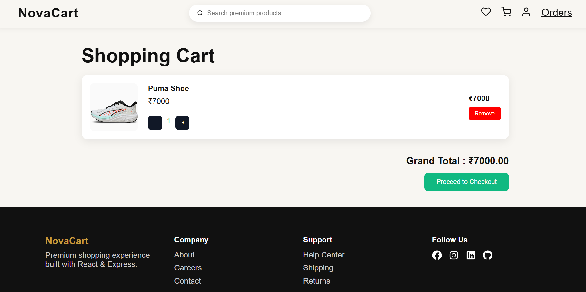
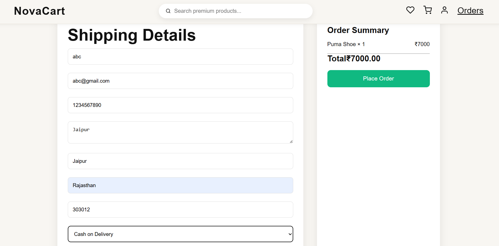

<div align="center">

# 🛒 NovaCart

### Modern Full Stack E-Commerce Web Application

Built with **React • Node.js • Express • SQLite**


A modern Full Stack E-Commerce Store developed during the **CodeAlpha Full Stack Development Internship**.

</div>

---

# 📌 Project Overview

NovaCart is a complete e-commerce application that allows customers to browse products, manage their shopping cart, place orders, and track purchases. It also includes a powerful admin dashboard for managing products, users, and orders.

The project demonstrates full-stack development using React for the frontend and Express with SQLite for the backend.

---

# ✨ Features

## 👤 Customer

- User Registration
- User Login
- Browse Products
- Product Details
- Shopping Cart
- Checkout
- Order History
- Responsive Design

---

## 👨‍💼 Admin

- Dashboard
- Product CRUD
- User Management
- Order Management
- Product Image Upload
- Dashboard Statistics

---

# 🛠 Tech Stack

## Frontend

- React.js
- Vite
- React Router DOM
- Context API
- CSS
- React Toastify

---

## Backend

- Node.js
- Express.js
- SQLite
- Multer
- JWT Authentication

---

# 📂 Folder Structure

```text
CODEALPHA_ECOMMERCE
│
├── client
│   ├── public
│   └── src
│
├── server
│   ├── config
│   ├── controllers
│   ├── database
│   ├── middleware
│   ├── routes
│   ├── uploads
│   └── server.js
│
├── screenshots
│
└── README.md
```

---

# ⚙️ Installation

## Clone Repository

```bash
git clone https://github.com/Harshitcodes01/CODEALPHA_ECOMMERCE.git
```

---

## Backend

```bash
cd server
npm install
npm run dev
```

---

## Frontend

```bash
cd client
npm install
npm run dev
```

---

# 📸 Application Screenshots

## 🏠 Home



---

## 🔐 Login


---

## 🛍 Products



---

## 🛒 Cart



---

## 💳 Checkout



---
## Admin Dashboard


# 🚀 Future Improvements

- Online Payment Gateway
- Wishlist
- Product Reviews
- AI Product Recommendation
- Inventory Analytics
- Email Notifications
- Dark Mode

---

# 👨‍💻 Author

**Harshit Raj Singh**

- GitHub: https://github.com/Harshitcodes01
- Linkedin: https://www.linkedin.com/in/harshit-raj-singh-502b18373 

---

# 📄 License

This project is created for educational purposes as part of the **CodeAlpha Internship Program**.

---

<div align="center">

### ⭐ If you like this project, consider giving it a star!

</div>

